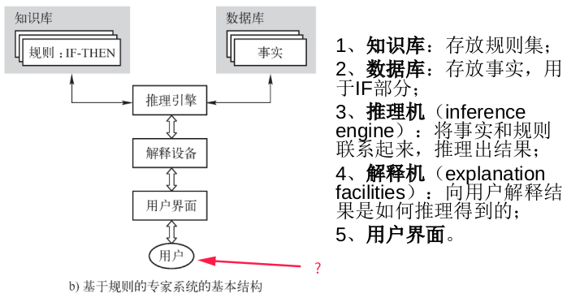

以下大部分涉及概念，计算题请看其他资料。更新中

# 人工智能

1. 人工智能之父?
2. AI缩写？
3. 深蓝、AlphaGo？
4. 深度学习之父 ?
5. 信息论的创始人 ？

1. 此问有争议！有三个人物需注意：
           阿兰·图灵。最早引出人工智能**思想**含义(1950年《计算机器与智能》)。图灵测试。

   ​        马文·<u>明斯基</u>。“人工智能之父”和**框架理论**的创立者。人工智能领域第一位图灵奖获得者(1969年)。

   ​       约翰·<u>麦卡锡</u>(John McCarthy)。**1956**年**Dartmouth**(达特茅斯)会议的发起人（该会议被视为AI作为一门学科**诞生**的标志），1955年在为该会议写的建议书(与Minsky,Rochester和Shannon一同撰写)中**提出**Artificial Intelligence一词，从而被视为“人工智能之父”。1958，发明*Lisp*编程语言（该语言至今仍在人工智能领域广泛使用）。人工智能领域第二位图灵奖获得者(1971年)。

2. Arficial Intelligence

3. 1997年,IBM的深蓝计算机击败世界第一棋手加里•卡斯帕罗夫（国际象棋）
   2017年,Google的阿法狗击败世界第一棋手柯洁（围棋）

4. 辛顿 

5. 香农

# 专家系统

1. 专家系统研发团队的主要参与者？
2. 基于规则的专家系统的结构？
3. 传统程序、专家系统和人类专家对比？
4. 专家系统的特性？
5. 个体如何适应与学习?
6. 专家系统是以____为基础，以____为核心的系统？
7. 前向(正向)推理是____驱动的。后向(逆向)推理是____驱动的?

1. 项目经理、领域专家、知识工程师、程序员、终端用户
2. 见下图
3. 见下图
   
4. 专家系统的特性
   1)、针对狭窄特定的领域
   2)、需要<u>快速</u>的执行效率
   3)、结果应该正确
   4)、具有解释机制
   5)、使用<u>符号化</u>推理
   6)、可能会犯错,因为人类专家也会犯错
   7)、知识和处理过程<u>隔离</u>
   8)、当信息不完整或模糊时,仍然可以得到某个合理的结论。传统程序这种情况下不会有结果
5. 个体如何适应与学习?
   1).建立<u>行为</u>系统的模型(Performance System)
   2).确立信用确认的机制(Credit Assignment)
   3).提供发现规则的手段(Rule Discovery)
6. 专家系统是以知识为基础，以推理为核心的系统。
7. 前向(正向)推理是数据驱动的。后向(逆向)推理是目标驱动的。 

# 不确定性与概率论

1. 自然界中的不确定现象?
2. 人类认知过程的不确定性？

1. 自然界中的不确定现象
   • 随机
   • 模糊
   • 混沌
   • 分形
   • <u>复杂</u>网络
2. 人类认知过程的不确定性
   感知的不确定性
   记忆的不确定性
   思维的不确定性

# 模糊系统

1. 模糊集四种操作？
2. 模糊集A={...}，B={...}，则A∪B=？
3. COG？

1. 交、并、补、包含
2. 
3. 

# 神经网络

1. 最简单的神经网络？
2. 感知器学习步骤？
3. 神经网络局限性？
4. 神经网络优越性？

1. 感知器
2. 初始化-->激活-->权重训练-->迭代
3. 神经网络的局限性:
   1)<u>不能</u>进行<u>特征学习</u>;
   2)比较容易过拟合,<u>参数</u>比较<u>难</u><u>调整,</u>而且需要不少技巧;
   3)训练<u>速度</u>比较<u>慢,</u>在层次比较少(小于等于3)的情况下效果并不比其它类型的方法更优;
4.  自学习功能、高速寻找优化解的能力、联想存储功能 

# 进化算法

1. 遗传算法的步骤？
2. 遗传算法之父 ？
3. 遗传编程概念？
4. LISP语言概念？

1. 遗传算法的步骤
   (1) 确定编码方案
   (2) 确定适应值函数
   (3) 选择策略的确定
   (4) 遗传算子的设计
   (5) 确定算法的终止准则
   (6) 控制参数的选取
   (7) 编程上机运行
2. 约翰•霍兰德(John Holland)
3. 遗传编程采用遗传算法的基本思想,用<u>树的分层结构</u>表示解空间,每个树结构对应于问题解空间的一个计算机程序。遗传编程通过使用杂交、变异等遗传操作和选择操作动态地改变这些树结构,并且一代代地演化下去直到找到合适于求解问题的计算机程序。
4. 列表处理语言,是最古老的高级编程语言之一,由<u>John McCarthy</u>在20世纪50年代末完成,
   是人工智能的标准语言之一。LISP基本数据结构是<u>原子和表</u>。

# 数据挖掘

1. 数据特征？
2. 有监督和无监督学习？
3. 什么是一个好的聚类方法?
4. 决策树的概念？
5. 数据挖掘基本方法？
6. 数据挖掘三个关键环节？
7. 什么软件包可用作数据的信息可视化?
8. 

1. 数据特征
   • 数据量大(Volume)
   • 类型繁多(Variety)
   • 价值密度低(Value)
   • 速度快时效高(Velocity)
2. 有监督和无监督学习
   有监督学习 (分类)
       训练集是带有类标签的
       新的数据是基于训练集进行分类的
   无监督学习 (聚集)
       训练集是没有类标签的
       提供一组属性,然后寻找出训练集中存在类别或者聚集
3. 什么是一个好的聚类方法?
   一个好的聚类方法要能产生高质量的聚类结果——簇,这些簇要具备以下两个特点:
           高的簇内相似性
           低的簇间相似性
    聚类结果的好坏取决于该聚类方法采用的相似性评估方法以及该方法的具体实现;
    聚类方法的好坏还取决与该方法是能发现某些还是所有的隐含模式;
4. 决策树的概念
          是一种由节点和边构成的用来描述分类过程的层次数据结构。该树的根接点表示分类的开始,叶节点表示一个实例的结束,中间节点表示相应实例中的某一属性,而边则代表某一属性可能的属性值。
          在决策树中,从根节点到叶节点的每一条路径都代表一个具体的实例,并且同一路径上的所有属性之间为<u>合取关系</u>,不同路径(即一个属性的不同属性值)之间为<u>析取关系</u>。
          决策树的分类过程就是从这棵树的根接点开始,按照给定的事例的属性值去测试对应的树枝,并依次下移,直至到达某个叶节点为止。
5. 回归分析；分类；聚类；关联规则挖掘；时间序列分析；......
6. 数据信息记录；数据模型建立；建立用户沟通渠道
7. 统计分析系统(SAS)；Statgraphics；Minitab；Matlab；......
8. 

# 知识表示

1. 框架理论中常见的槽有？

1. ISA槽、AKO槽、Instance槽、、、